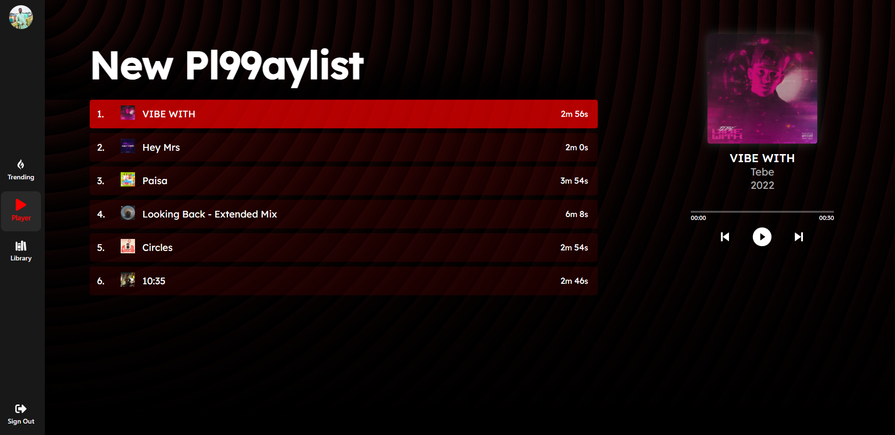

# LynkMusic 🎵

LynkMusic is a web-based music streaming application that offers users an intuitive interface to explore, play, and manage their favorite tracks.

---
## Demo

You can checkout the Demo for this App here: https://lynk-music.onrender.com/

## Features ✨

- **Trending Library:** Browse and search a vast collection of songs.
- **Playlists:** Create, edit, sort and manage personal playlists.
- **Audio Player:** Integrated player with controls for play, pause, skip, and volume.

---

## Screenshots 🌟

### Login Page


### Playlists


### Player


## Tech Stack 🛠️

- **Frontend:** React.js
- **State Management:** Context API
- **Styling:** CSS Modules
- **Routing:** React Router

---

## Installation & Setup 🚀

1. **Clone the repository:**
   ```bash
   git clone https://github.com/VibekRoy/lynkmusic.git
   cd lynkmusic
   ```

2. **Install dependencies:**
   ```bash
   npm install
   ```

3. **Start the development server:**
   ```bash
   npm start
   ```
   The application will run on `http://localhost:3000`.

---

## Available Scripts 📜

In the project directory, you can run:

- **`npm start`**: Runs the app in development mode.
- **`npm test`**: Launches the test runner.
- **`npm run build`**: Builds the app for production.
- **`npm run eject`**: Ejects the app configuration. *Note: This is a one-way operation.*

---

## Deployment 🏗️

To deploy the application:

1. **Build the app:**
   ```bash
   npm run build
   ```
   This will create an optimized production build in the `build` folder.

2. **Deploy to a hosting provider:**
   - You can deploy the contents of the `build` folder to platforms like Vercel, Netlify, or GitHub Pages.

---

## Contributing 🤝

Contributions are welcome! To contribute:

1. Fork the repository.
2. Create a new branch (`git checkout -b feature/YourFeature`).
3. Commit your changes (`git commit -m 'Add YourFeature'`).
4. Push to the branch (`git push origin feature/YourFeature`).
5. Open a Pull Request.

---

## Contact 📬

For any queries or feedback:

- **Author:** Vibek Roy
- **Email:** vibekroy321@gmail.com
- **GitHub:** [VibekRoy](https://github.com/VibekRoy)
